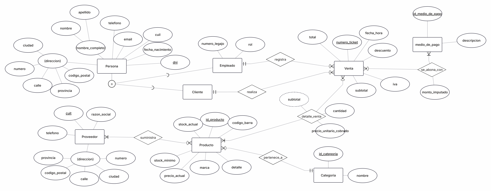
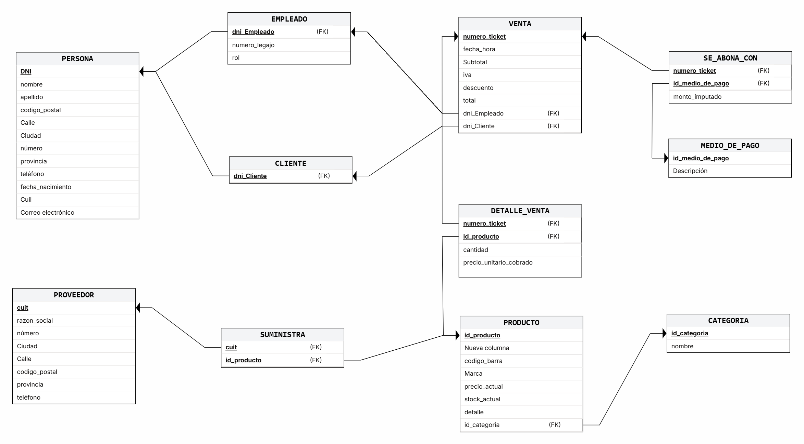

<div align="center">

<a href="https://git.io/typing-svg"></a>

# Proyecto Estudio

## Supermercado "El Sol"

<p>
  
  
  
  
</p>

</div>

---

## Descripción

Proyecto de estudio correspondiente a la cátedra Bases de Datos I (FaCENA, UNNE). Consiste en el diseño conceptual, lógico e implementación de una base de datos relacional para el **Supermercado "El Sol"**, un comercio minorista de consumo masivo.

## Objetivos del sistema

|  #  | Objetivo                                                                             |
| :-: | :----------------------------------------------------------------------------------- |
|  1  | Registrar ventas en línea de cajas con detalle de artículos, cajero y medios de pago |
|  2  | Mantener el precio histórico de venta congelado al momento de cada compra            |
|  3  | Monitorear el stock con alertas de reposición entre depósito y góndolas              |
|  4  | Gestionar clientes frecuentes para promociones y ventas a consumidor final           |
|  5  | Administrar el reabastecimiento de mercadería con la red de proveedores              |

## Estructura del repositorio

```text
proyecto-bd1-equipo-46/
├── docs/
│   ├── etapa-01/          Requerimientos y dominio del negocio
│   ├── etapa-02/          DER, modelo relacional y normalización
│   ├── etapa-03/          Implementación de la base de datos
│   ├── etapa-04/          Consultas y casos de uso
│   └── etapa-05/          Temas técnicos y optimización
├── sql/
│   ├── ddl/               Definición de estructuras
│   ├── dml/               Carga de datos
│   ├── consultas/         Consultas del negocio
│   └── tecnico/           Objetos técnicos (vistas, triggers, etc.)
└── README.md
```

## Avance del proyecto

| Etapa | Contenido                                            |                                     Estado                                     |
| :---: | :--------------------------------------------------- | :----------------------------------------------------------------------------: |
|  01   | Requerimientos y dominio del negocio                 |    |
|  02   | Modelo conceptual, relacional y normalización        |    |
|  03   | Implementación de la base de datos (DDL y DML)       |  |
|  04   | Consultas del negocio y casos de uso                 |  |
|  05   | Temas técnicos (procedimientos, triggers, seguridad) |  |

## Documentación

<details>
<summary><b>Etapa 01 — Requerimientos y dominio del negocio</b></summary>
<br>

- [Descripción del caso de estudio](docs/etapa-01/descripcion-caso-estudio.md)
- [Alcance del sistema](docs/etapa-01/alcance-sistema.md)
- [Reglas de negocio](docs/etapa-01/reglas-de-negocio.md)

</details>

<details>
<summary><b>Etapa 02 — Modelado conceptual y relacional</b></summary>
<br>

- [Diagrama Entidad-Relación (DER)](docs/etapa-02/der/SupermercadoElSol-DER-final.png)
- [Componentes del modelo conceptual](docs/etapa-02/der/componentes-del-modelo-conceptual.md)
- [Decisiones de diseño del DER](docs/etapa-02/der/decisiones-diseno-der.md)
- [Decisiones de diseño del Modelo Relacional](docs/etapa-02/decisiones-modelo-relacional.md)
- [Modelo Relacional](docs/etapa-02/SupermercadoElSol-modelo-relacional(corregido).png)
- [Normalización](docs/etapa-02/normalizacion.md)

</details>

## Diagrama Entidad-Relación

<p align="center">
  
</p>

## Diagrama del Modelo Relacional

<p align="center">
  
</p>

## Integrantes — Equipo 46

<div align="center">

|       Integrante        |
| :---------------------: |
|      Espinola Luz       |
|  López Alfredo Gabriel  |
| Maciel Jorge Alejandro  |
|     Vega José María     |
| Villagra Facundo Nahuel |

</div>
