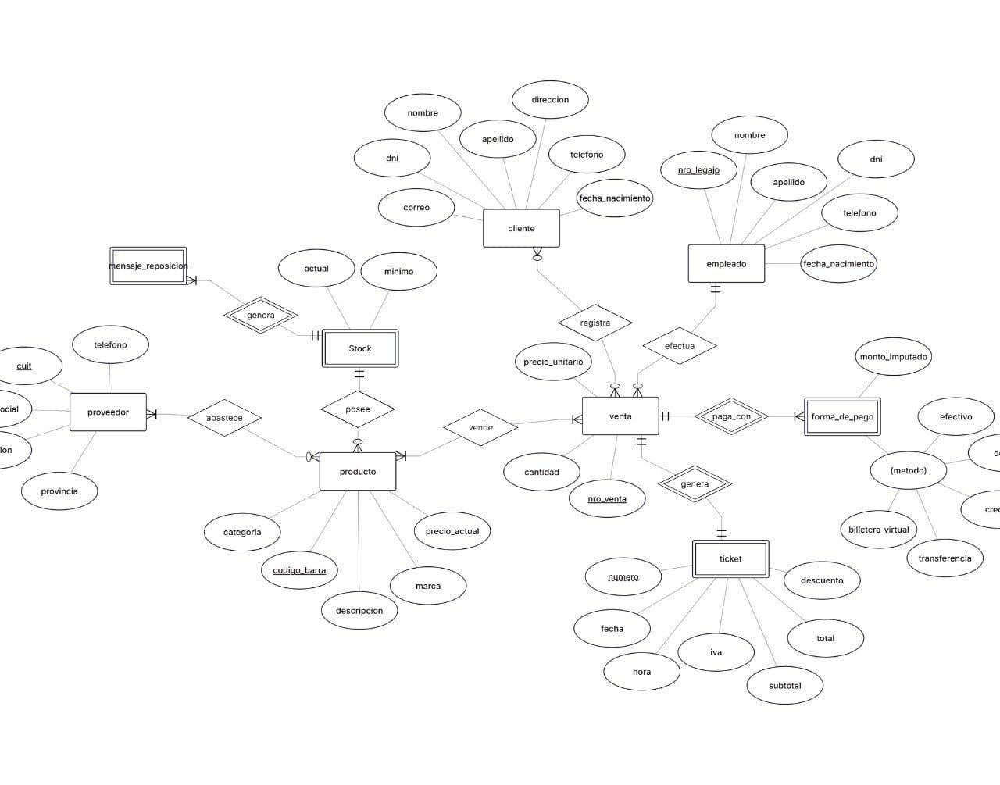

# Sistema de Gestión de Ventas - ElectroHogar S.A.
### Proyecto Estudio | Bases de Datos I - Equipo 46
#### Licenciatura en Sistemas de Información - FaCENA (UNNE)

Proyecto estudio de la cátedra Bases de Datos I (UNNE). Consiste en el diseño conceptual, lógico e implementación de una base de datos relacional para la gestión de ventas, clientes, empleados y control de stock de la empresa ficticia ElectroHogar S.A.

## Documentación por Etapas

* **[Etapa 01](docs/etapa-01/)**:
  * [Descripción del caso de estudio](docs/etapa-01/descripcion-caso-estudio.md)
  * [Alcance del problema](docs/etapa-01/alcance-problema.md)
  * [Reglas de negocio](docs/etapa-01/reglas-negocio.md)
  * [Decisiones de diseño](docs/etapa-01/decisiones-diseno.md)

* **[Etapa 02](docs/etapa-02/)**:
  * [Componentes del modelo conceptual](docs/etapa-02/der/componentes-modelo-conceptual.md)
  * [Modelo Relacional](docs/etapa-02/modelo-relacional.md)
  * [Normalización](docs/etapa-02/normalizacion.md)
  * [Decisiones de diseño](docs/etapa-02/decisiones-diseno.md)

## Diagrama Entidad-Relación (DER)

  

## Integrantes - Equipo 46

* Espinola Luz
* López Alfredo Gabriel
* Maciel Jorge Alejandro
* Vega José Maria
* Villagra Facundo Nahuel